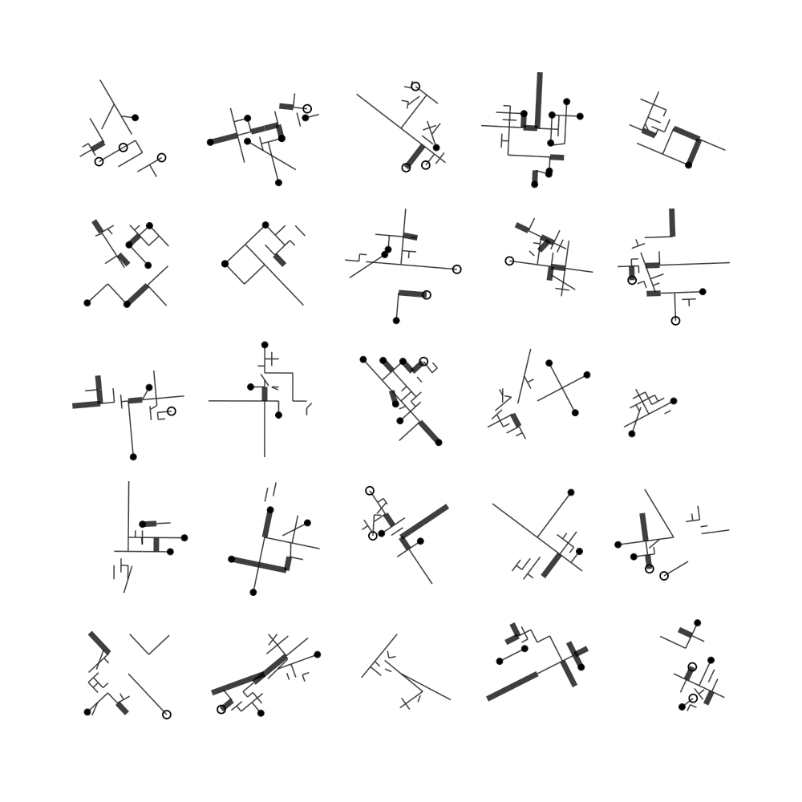
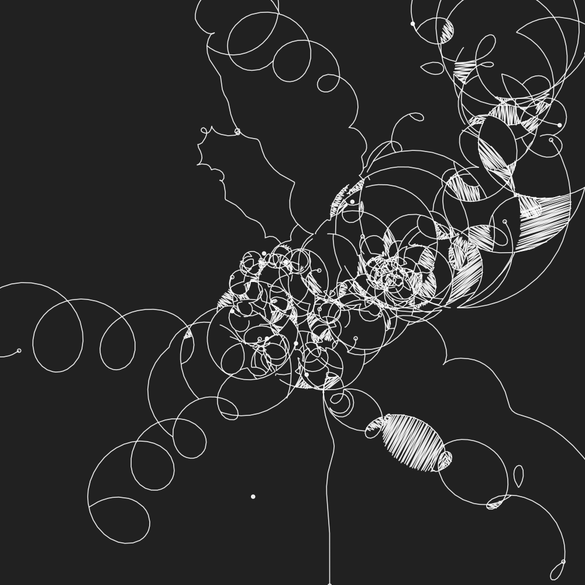
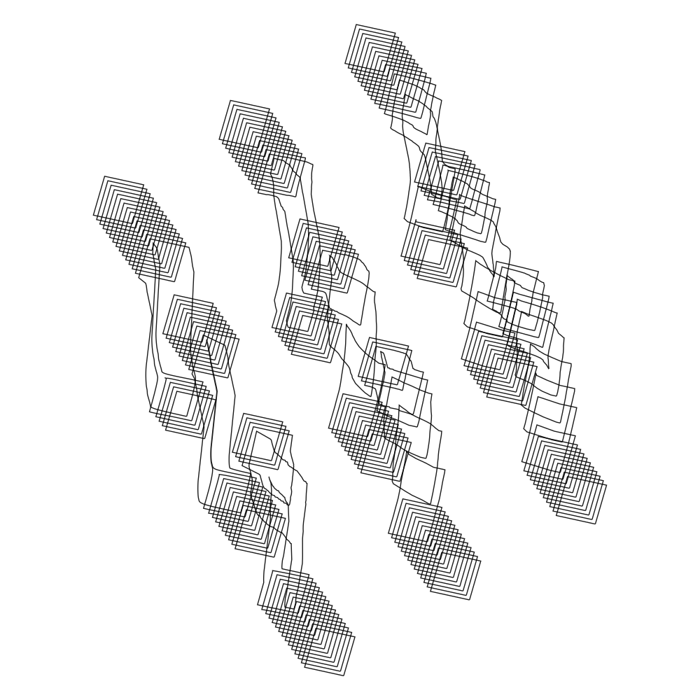

# WEIRD-A Generative Art System

**NOTE: This code is likely to change with little or no warning. You should not
use this for anything remotely important. Make sure to clone the repo if you
need it to remain stable.**

**NOTE: An improved version of the graph data structure in the `weir` package
can be found in my new project:
[cl-grph](https://github.com/inconvergent/cl-grph). Among multiple
improvements, the graph structure in `grph` is immutable, and supports Datalog
queries.**

## About

`weird` is the next iteration of [weir](https://github.com/inconvergent/weir),
which was the next iteration of [snek](https://github.com/inconvergent/snek).

The library is written to be useful for a broad range of ways in which I create
art using generative algorithms. Almost everything I have made over the past
several years has been made using some version of this system.


## Components

Here are the main components:

1. 2d/3d vector mathematics via
   [cl-veq](https://github.com/inconvergent/cl-veq).  See
   [examples](https://github.com/inconvergent/cl-veq/blob/master/examples/ex.lisp)
   in veq for more details.

2. A simple (undirected) graph data structure called `weir`. The structure can
   be manipulated directly, or via `alterations`. The latter is described in
   more detail below. Here is a simple example of how you can manipulate the
   structure directly:

   ```lisp
   (in-package :weir)
   (let ((wer (make)))
     ; add three edges
     (loop repeat 3
           do (add-edge! wer
                (2add-vert! wer
                  (rnd:2in-circ 200.0))
                (2add-vert! wer
                  (veq:f2+ (veq:2rep 500.0)
                           (rnd:2in-circ 200.0))))
     ; iterate verts
     (itr-verts (wer v)
       ; prints vert coordinates
       (veq:vpr (2get-vert wer v)))

     ; iterate edges
     (itr-edges (wer vv)
       (veq:vpr (2get-verts wer vv)))

     ; move a vert relativ to current position:
     (2move-vert! wer 0 1.0 2.0)
     ; or to an absolute position
     (2move-vert! wer 1 1.0 2.0 :rel nil)

     ; edges are represented as lists of verts, and they are always
     ; sorted with the smallest vert index first, so both of these
     ; return t:
     (edge-exists wer '(0 1))
     (edge-exists wer '(1 0))

     ; get edges incident to vert 0
     (get-incident-edges wer 0))
   ```
   See [examples/draw.lisp](examples/draw.lisp) and
   [examples/ex.lisp](examples/ex.lisp) for more.

3. Random numbers, some examples:

   ```lisp
   (in-package :rnd)
   (rnd a) ; in range [0.0, a), defaults to a=1.0.
   (rnd* a) ; in range [-a, a), defaults to a=1.0.
   (rndrng a b) ; in range [a, b)
   (rndi 10) ; random fixnum
   (rndspace n a b) ; n numbers in [a, b)
   (norm :mu 0.0 :sigma 1.0) ; normal distribution
   (2in-circ a) ; in circle of radius a
   (2in-rect w h) ; in a rectangle
   (2nin-rect n w h) ; n in rectangle.
   (2on-line ax ay bx by) ; point between points a and b

   ; do something with probability 0.1, second form is optional
   (prob 0.1 (print "10% hi") (print "90% oh no"))

   ; perform either form 1 or (optionally) 2
   (either (print "form 1") (print "form 2"))
   ```

   See [rnd.lisp](src/rnd/rnd.lisp), [2rnd.lisp](src/rnd/2rnd.lisp) and
   [3rnd.lisp](src/rnd/3rnd.lisp), for all available functions.

4. A tool for drawing `svg` files: `wsvg`. See [draw.lisp](/examples/draw.lisp).

In addition the library contains a number of useful tools for dealing with
(predominantly) vector graphics.


## Weir Graphs and Alterations

In my opinion, the most interesting part of the `weir` graph structure is
`alterations`. An `alteration` is a change that will be applied to the
structure at the end of a given context, provided it is valid.

The main motivation behind this is that this makes it possible to gather up a
number of changes that will be applied to the graph at a later time. This makes
it possible to access the state in the `weir` instance while you are creating
the alterations. Without there being any changes made to the state of the
`weir` instance while the alterations are being created. Once all alterations
are created, the valid ones will be applied.

Existing alterations in `weir` are postfixed with `?`. It might look like this:

```lisp
(weir:with (wer %)
  (% (add-vert? (veq:f2 100.0 740.0))
  (% (add-edge? 1 4)))
```

`(% ...)` is used to collect alterations. They will be executed at the end of
the `with` context. If an `alteration` evaluates to `nil`, nothing will happen.

Here is an example of how the forces are calculated in my [Tangle of Webs
simulation](https://inconvergent.net/2019/a-tangle-of-webs/):

```lisp
(veq:vdef* reciprocal-edge-forces (wer &key (stp 0.1))
  (weir:with (wer %)
    ; state of wer is unaltered
    (weir:itr-edges (wer e) ; edge (v0 v1)
      ; vector from v0 to v1
      ; force is proportional to this "oriented distance"
      (veq:f2let ((force (veq:f2-
                           (veq:f2$ (weir:2get-verts wer e)
                                    1 0))))
        (loop for i in e and s in '(-1.0 1.0)
              ; alteration is created, but nothing happens
              do (% (2move-vert? i
                      (veq:f2scale force (* s stp)))))))))
    ; alterations are applied at the end
    ; of the context
```

The important thing to note here is that for the forces to be calculated
correctly, all edge lengths must be calculated _before_ the forces are applied
to the vertices.



### Futures and Dependencies

You can assign a name to the result of an alteration using
```lisp
(% (add-edge? 1 3) :res :some-name?)
```
This makes it possible to create alterations that depend on the result of other
alterations:

```lisp
(in-package :weir)
(with (wer %)
  (veq:f2let ((pt (veq:f2 1f0 3f0)))
    (% (2add-vert? pt) :res :a?) ; alteration result is named :a?
    (% (2add-vert? (veq:f2 1.0 2.0)) :res :b?) ; result named :b?
    (% (add-edge? :a? :b?)))) ; depends on :a? and :b?

; all alteration results:
(print (get-alteration-result-list wer))
; or as a `hash-map`:
(print (get-alteration-result-map wer))
```

`alteration` names must be `keywords` that end with `?`. (There is an
exception, see [Looping](#Looping) below.) And using the same name for multiple
alterations _will_ result in undefined behaviour.

As you can see, a named alteration is akin to a _future_; a reference to a
result that may or may not exist eventually. For this to work, any alteration
that depends on a future that fails (or returns `nil`) will be skipped.

You can use `(weir:with (wer % :bd t) ...)` to see how an alteration is
expanded. This might make it easier to see what is going on.

As en example. The `alteration`:
```lisp
(% (2move-vert? :vert?
     (veq:f2scale
       (veq:f2- (veq:f2$ (weir:2get-verts wer '(1 3)) 1 0))
       1f0)))
```
will be expanded to:
```lisp
(VEQ:F2LET
 ((#:OUT-F2!P53
   (VEQ:F2SCALE (VEQ:F2- (VEQ:F2$ (WEIR:2GET-VERTS WER '(1 3)) 1 0)) 1.0)))
 (LET ((#:OUT-REL54 T))
   (LAMBDA (#:WER541)
     (CASE (WEIR::-IF-ALL-RESOLVED #:ALT-RES29 (LIST :VERT?))
       (:OK
        (VALUES T
                (PROGN
                 (WHEN
                     (WEIR::-VALID-VERT #:WER541
                                        (VALUES (GETHASH :VERT? #:ALT-RES29)))
                   (PROGN
                    (WEIR:2MOVE-VERT! #:WER541
                                      (VALUES (GETHASH :VERT? #:ALT-RES29))
                                      (WEIR::VAL* #:OUT-F2!P53)
                                      :REL #:OUT-REL54)
                    (VALUES (GETHASH :VERT? #:ALT-RES29)))))))
       (:BAIL (PROGN NIL (VALUES T NIL)))
       (T (VALUES NIL NIL))))))
```
Which won't work in its own unless `:VERT?` is also defined. But you can see how
the promise resolution is handled. And how values (`#:OUT-REL54`,
`#:OUT-F2!P53`) are defined in the surrounding closure.



### Looping

It is possible to use `alterations` inside loops as well. but it requires a bit
more careful consideration. Here is an example:


```lisp
(in-package :weir)
(with (wer % :db t)
  (loop for x in (math:linspace 20 -20.0 20.0) do
    (loop for z in (list 1.0 2.0) do
      (veq:f3let ((xy (veq:f3 x y z)))
        ; create a distinct name
        (let ((g? (gensym "g")))
          (% (add-grp? :name (gensym "line")) :res g?)
          (% (2add-path?
               (veq:f$_ (list (veq:f3-
                                xy (veq:f3 1.0 8.0 (rnd:rnd)))
                              (veq:f3+
                                xy (veq:f3 1.0 2.0 (rnd:rnd)))))
               :g g?)))))))
```


## Writing

I have written about things related to this code at:

  - https://inconvergent.net/2017/snek-is-not-an-acronym/
  - https://inconvergent.net/2017/a-method-for-mistakes/
  - https://inconvergent.net/2017/arbitrary-alterations/
  - https://inconvergent.net/2017/grains-of-sand/
  - https://inconvergent.net/2017/a-propensity-for-mistakes/
  - https://inconvergent.net/2020/future-alterations/
  - https://inconvergent.net/2021/future-alterations-and-loops/

Note that these posts refer to older iterations of the code. So some of the
things will be out of date.




## On Use and Contributions

This code is written for my personal use, and parts of it is rather
experimental. Also, it is likely to change at my whim. For this reason I don't
recommend depending on this library for anything.

I release it publicly in case people find it useful or interesting. It is not,
however, intended as a collaboration/Open Source project. As such I am unlikely
to accept PRs, reply to issues, or take requests.


## Installation and Dependencies

`weird` depends on [cl-veq](https://github.com/inconvergent/cl-veq), and
it requires Quicklisp to install dependencies (which are listed in
`weird.asd`).

To install and load `weird`, do:
```lisp
(ql:quickload :weird)
```
If this does not work, `weird` may not be in a place Quicklisp or ASDF can see
them. To fix this, either:
```lisp
(load "weird.asd")
```
For a long term solution, add the following to `.sbclrc`:
```lisp
#+quicklisp
(push "/path/to/dir/containing/weird" ql:*local-project-directories*)
```
You will have to make sure `cl-veq` is also available in the same fashion for
any of this to work.

### Versions and Compatability

Weird version 6.1.0 requires version `cl-veq` 2.2.0.


### Tests

Tests can be executed using: `(asdf:test-system :weird)`.


## Thanks

I would like to thank:

  - https://twitter.com/RainerJoswig
  - https://twitter.com/jackrusher
  - https://twitter.com/paulg
  - https://twitter.com/porglezomp
  - https://twitter.com/stylewarning
  - https://github.com/Hellseher

Who have provided me with useful hints and code feedback.

The ASDF config and test setup was kindly suggested and implemented by Robert
Smith (https://twitter.com/stylewarning). Although I have made some changes
since then.

Also, many thanks to https://twitter.com/xach for making Quicklisp.

